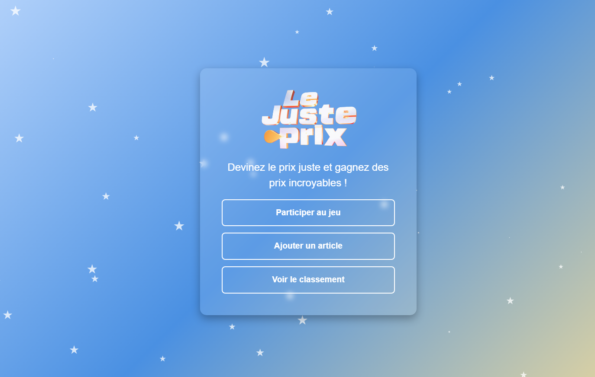
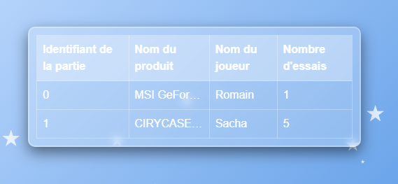

# Projet DZ sur Amazon
(en fait c'est un "Juste prix" sur Amazon)
## Auteurs
- [Louis Derancourt](https://gitlab.univ-artois.fr/louis_derancourt) (Développeur, Scrum master, Exécution principale)
- [Romain Notteau](https://gitlab.univ-artois.fr/romain_notteau) (Développeur, Style, Base de données)
- [Sacha Fauquet](https://gitlab.univ-artois.fr/sacha_fauquet) (Développeur, API, Articles)
- [Nathan Cheam](https://gitlab.univ-artois.fr/nathan_cheam) (Développeur, HTML, Tableau)

## Installation
``git clone https://gitlab.univ-artois.fr/romain_notteau/msi_les_dz.git``

## Utilisation
Exécuter le fichier app.py
``python msi_les_dz/app.py``

## Pages
- Accueil
    - Jeu
        - Score
    - Ajouter un article
        - confirmation
    - Tableau des Scores

## Features
**Général**
- Style Css
- Mode jour/nuit
- Bouton de retour à l'accueil
- Bouton de changement de thème  

**Accueil**
- Bouton pour lancer le jeu (avec choix de difficulté)
- Bouton pour ajouter un article
- Bouton pour voir le tableau des scores
- Tableau des scores (si actif)

**Jeu**
- Affichage des infos (en fonction de la difficulté)
- Champs de texte (numérique) pour la réponse
- Bouton pour valider la réponse
- Affichage d'un message (avec le nombre d'essais) en fonction de la réponse
- Invalidation d'une proposition déjà faite

**Score**
- Affichage du score
- Champs de texte pour le pseudo
- Bouton pour valider le score

**Ajouter un article**
- Champs de texte pour l'URL Amazon de l'article
- Bouton pour valider l'ajout
- Affichage de l'article ajouté
- Invalidation d'un article déjà ajouté

